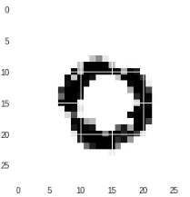
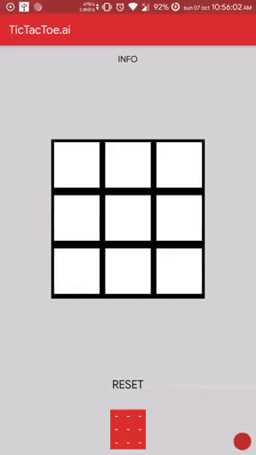

# XO-Models
Code of models trained while creating XO application. CNN model to differ X and O that are drawn by user in 28 x 28 canvas. GAN use to draw from the computer side

## Dataset Samples

## Generated Samples from GANs

## App Results

## Frozen graph of CNN
at out/opt_xo_differ.pb  
	input_node_name = 'input'  
	keep_prob_node_name = 'keep_prob'  
	output_node_name = 'output'  

## Frozen graph of GAN_O
at GAN_O/opt_gan_O.pb  
	input_node_name = 'noise_input_o'  
	output_node_name = 'gen_o'  

## Frozen graph of GAN_X
at GAN_X/opt_gan_X.pb  
	input_node_name = 'noise_input_x'  
	output_node_name = 'gen_x'  