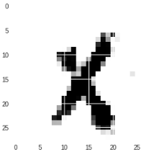

# XO-Models
Code of models trained while creating XO application. CNN model to differ X and O in 28 x 28 image.

## Dataset Samples

## Generate Sample from GAN

## App Results

## Frozen graph of CNN
at out/opt_xo_differ.pb 
	input_node_name = 'input'
	keep_prob_node_name = 'keep_prob'
	output_node_name = 'output'

## Frozen graph of GAN_O
at GAN_O/opt_gan_O.pb 
	input_node_name = 'input'
	output_node_name = 'output'

## Frozen graph of GAN_X
at GAN_X/opt_gan_X.pb 
	input_node_name = 'input'
	output_node_name = 'output'